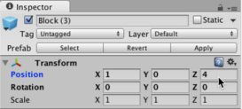

# Making Minecraft

This tutorial shows a way to create the very basic game mechanics of Minecraft:
blocks that can be broken to drop items, a first person player who can pick up
the dropped item.

This tutorial was developed in `OS X Yosimite Version 10.10.3 (14D136)`
with `Unity Version 5.1.0f3 Personal`
and
`MonoDevelop-Unity Version 4.0.1`.

## Preliminaries

Create a 3D project and select the default layout in the editor.

  1. 3D project

     

  2. Default layout

     

## Basic Objects and Mechanics

Here we build the ground, the block prefab, and the item drop prefab.

### Ground

You can think of the following as a quick and dirty substitute for a layer of
bedrock.

  1. `Hierarchy | Create | 3D Object | Plane`
  
     

     In the `Hierarchy View`, click the `Create` dropdown, select `3D Object`
     and then `Plane`.

  2. `Inspector | Transform | Scale ( 16, 1, 16)`

     
     

     Scale the plane in the `x` and `z` directions for plenty of room to play
     on.  The `Inspector` shows the components of the game object that is
     selected in the `Hierarchy View`, so make sure the `Plane` game object is
     selected in the `Hierarchy View` before modifying the `Transform`
     component.

  3. `Inspector | Transform | Position ( 0, -0.5, 0)`

     

     Lower the plane by half a unit.
     Doing this leaves space for unit cubes centered at `y=0` so they will be
     on top of the plane.

### Blocks

We will make a block prefab, add a script to it, and add a material to it.
Explanations of prefabs, scripts, and materials are provided below as
encountered.

#### Making a Block Prefab

  1. `Hierarchy | Create | 3D Object | Cube`

     

     Create a `Cube` game object.

  2. In the `Inspector`, rename `Cube` to `Block`.

     

     Select the `Cube` game object in the `Hierarchy View` first.

     

     Click on `Cube` in the field at the very top of the `Inspector View`.

     

     Change it to `Block`.

     Note that we can name it whatever we want or even leave it with the
     default name. We just have to be consistent with what we call it thereafter.
     Since cubes in Minecraft are called &ldquo;blocks&rdquo;, it makes sense
     to call them that in this project.

  3. Drag the `Block` game object from the `Hierarchy View` into the `Assets`
     folder of the `Project View`.

     

     This makes it a &ldquo;prefab&rdquo;.
     Prefabs can be added to the game multiple times resulting in multiple game
     objects that are clones of the prefab. Then changes to the prefab apply to
     all of those game objects. This is very useful to avoid having to modify
     loads of game objects just to make a simple change.  It is also useful to
     make prefabs because they can be &ldquo;instantiated&rdquo; from scripts
     dynamically at run time.  We will eventually want to do this in order to
     produce a procedurally generated terrain of blocks.

  4. Drag a few `Block` prefabs into the scene.

     

  5. In the `Inspector` for each block, manually assign their position
     coordinates to be integers and make them all have `y=0` in particular.

     
     

     Observe that Unity automatically numbers the game objects generated from
     prefabs.

     
     

     
     

#### Save the Scene and the Project

  1. `File | Save Scene`

     Select `File` and `Save Scene`.

     

     We will only have the one scene, so no need for a very purposeful name.
     Let's just name it `Scene`.

     Now a scene asset named `Scene` will appear in the `Assets` folder of the
     `Project View`.

     

  2. `File | Save Project`
  
     Select `File` and `Save Project`.

     

     The project already has a name from when we created it, so there will not
     be a prompt for naming it.

#### Adding a Script to the Block Prefab

  6. In the `Assets` folder of the `Project View`, right-click and select
     `Create | C# Script`

     

  7. Rename it to `MineBlock`.

     

     Its default name is `NewBehavior`.
     Just type over that to change it to `MineBlock`.

     

     Now double-click the `MineBlock` C# asset. That will cause the script to be loaded in Mono.

     

     There is a `Start` function and an `Update` function. They are empty to
     start with. We could write code in them, but we won't for now.
     We can also add other functions. We will add another function soon.

     It is important to realize first and foremost, however, that this script
     needs to be &ldquo;attached&rdquo; to a game object (or multiple game objects).
     Let's go ahead and attach it to our block prefab before
     delving into actual coding in the script.

  8. Go back to Unity and select the `Block` prefab.

     

     Now click and drag the `MineBlock` script asset over to the `Add Component`
     button in the `Inspector View` for the `Block` prefab and drop it there.

     

     The `MineBlock` script will be added as a component to the `Block` prefab.

     

     Note that the `Add Component` button activates a menu through which we could
     have added the script as well. (There are usually multiple different ways of
     accomplishing the same thing.)

  9. Go back to Mono and add the following `OnMouseDown` function to the `MineBlock` script.

     

     Here's the code for you to copy-and-paste if necessary:

           void OnMouseDown() {
               Destroy( gameObject);
           }

     However, it is recommended that you type the code yourself to help you
     learn the patterns.

  10. Go back to Unity and run the game by clicking on the play button.

     

     After clicking play, the buttons will be colored blue signifying that the game is playing.

     

     While the game is running, click on some of the blocks and watch them
     disappear. They disappear because of the `Destroy` statement in the
     `OnMouseDown` function of the `MineBlock` script that is attached to the
     block game objects via the `Block` prefab. Whenever the mouse button is
     clicked with the mouse cursor hovering over a block, the `OnMouseDown`
     function of that block executes and thus the `Destroy(gameObject)`
     statement executes. Note that `gameObject` refers to the game object to
     which the script that contains the function that's executing is attached.

     Click the play button again to stop the game.

     **WARNING:** If you fail to stop the game before going on to make changes
     to the game, your changes will be lost when the game is stopped.  You
     *must* stop the game before making changes that you want to keep.  Note
     that it can sometimes be useful to make temporary changes to the game
     while it is running just for the purpose of diagnostics and
     experimentation, but in any case you should always be alert to whether the
     game is running or not before making changes.

  11. Save the scene and the project.

#### Hide the original `Block` game object

In the next section we are going to add a new game object to the scene.
To keep the scene view clean in preparation for that, we will now hide the
original `Block` game object that we used to make the `Block` prefab. Also,
eventually, we will be placing multitudes of blocks from a script at run time
in some systematic way and will want to remove *all* of the hand-placed blocks
from the initial scene. For now, we will leave the other few blocks that were
added to the scene via the prefab just to have something there in the
meantime. We do want to hide the original one, though, because it occupies
the special origin location that other new game objects will occupy by default.
(Alternatively, we could just move it out of the way, but we are going to
want to hide it eventually anyway so let's just do it now.)

  1. In the `Hierarchy View`, select the `Block` game object.

     

  2. In the `Inspector View`, uncheck the checkbox next to the game object's name field.

     

     That game object should no longer appear in the scene. It is still listed in the
     `Hierarchy View` although dimmed.

### Drops

In Minecraft, when a block is &ldquo;mined&rdquo; it can drop a resource which
appears as a smaller version of the block floating in the space that the
original block had occupied.  This section shows how to create a dropped block
prefab and cause it to be instantiated in place of blocks whenever blocks are
destroyed.

  1. `Hierarchy | Create | 3D Object | Cube`

     

     Create another `Cube` game object.

  2. Rename it `DroppedBlock`.

     

  3. `Inspector | Transform | Scale (0.5,0.5,0.5)`

     

     Make it smaller.

  4. `Inspector | Transform | Rotate (15,0,5)`

     

     Rotate it.

     Feel free to adjust the scale and rotation as desired. To make it look like a dropped item, it just
     needs to be smaller and tilted.

  5. Make a prefab from the `DroppedBlock` game object by dragging it into the
     `Assets` folder of the `Project View`.

     

  6. Select the source `DroppedBlock` Game Object and hide it.

     
     

  7. Go to Mono and edit the `MineBlock` script by adding this line

           public GameObject droppedBlockPrefab;

     before the Start function:

     

  8. Go back to Unity and select the `Block` prefab.

     

     Look at the `Inspector View` and see the `Dropped Block Prefab` field in the `Mine Block (Script)` component.

     

     That field was put there automatically by the Unity editor after we
     declared the `droppedBlockPrefab` variable in the `MineBlock` script.

     Now drag the `DroppedBlock` prefab into that `Dropped Block Prefab` field.

     

     

     This will cause the `droppedBlockPrefab` variable in the `MineBlock`
     script to be initialized to the `DroppedBlock` prefab when the game runs.
     It is in this way that our script will have access to that prefab.

  9. Finally, add this line

           Instantiate( droppedBlockPrefab, transform.position, droppedBlockPrefab.transform.rotation);

     to the `OnMouseDown` function of the `MineBlock` script right before the `Destroy` statement.

     

     This causes the `DroppedBlock` prefab to be &ldquo;instantiated&rdquo; as a game object
     at the same position as the block that was clicked and with the rotation
     that we specified in the `Inspector` for the `DroppedBlock` prefab.

  10. Go back to Unity and play the game. See that when you click a `Block` game object, a
      `DroppedBlock` game object appears in its place.

  11. Stop the game.

  12. Save the scene and the project.

## First Person Character

### Import Assets

  1. `Assets | Import Package | Characters`

     

  2. Click the "None" button to uncheck all of the options.

     

  3. Click the checkbox next to `FirstPersonCharacter`.

     

     Now just the FirstPersonCharacter asset is selected.

     

  4. Click the `Import` button.

     

     Notice the new `StandardAssets` folder inside your `Assets` folder of the `Project View`.

     

     You will also notice an error message in the Unity status bar. If you click the `Console` tab
     next to the `Project` tab, you will see other messages, too.
     There are a couple of dependencies that we need to import before we can use the
     `FirstPersonCharacter` standard asset.

  5. `Assets | Import Package | CrossPlatformInput`

     

     

     And now there is a new folder named `Editor` inside the `Assets` folder of the `Project View`.

     

  6. `Assets | Import Package | Utility`

     

     

     No additional new folders will appear at the top level of the `Assets`
     folder this time, but you'll see that the error messages have disappeared
     now.

### Add to the Scene and Configure the FirstPersonCharacter

  1. Under the `Assets` folder in the `Project View`, expand `StandardAssets`,
     `Characters`, `FirstPersonCharacter`, and then select `Prefabs`.

     

     Notice the `FPSController` prefab. That's what we are going to use.

  2. Drag the `FPSController` prefab into the scene.

     

     Drop it somewhere near the current camera.

     

  3. Remove the old camera which is called `Main Camera`.

     

     The `FPSController` prefab comes with its own camera built in.

  7. Adjust the `y` coordinate of the `FPSController` position so that it is
     completely above the plane, e.g., `y=2`.

     
     

     It's okay if it starts higher than the plane. It will fall to the surface
     when the game begins.

  4. Save the scene and project.

     
     

  5. Run the game.

     

     Notice that the camera follows the cursor as expected for a first person
     character. Also, you can use the `W` `A` `S` `D` keys to make the player walk and the
     `SPACE` bar to make it jump.

  6. Stop the game.

     

  8. Adjust the scale of the `FPSController` to `(0.5,0.9,0.5)`.
  
     
     

     This will make it possible for the character to fit through one block wide
     and two block high openings (eventually).

### Lock the Mouse

The way the player interacts with the scene will be more natural if the cursor is always in the center of the
screen (like the crosshairs of Minecraft).

  1. Select the `Assets` folder in the `Project View` and create a new `C# Script`.

     

  2. Rename the new script to `MouseLock`.

     
     
     

  3. Select the FPSController game object.

     

  4. Scroll down in the `Inspector View` until the `Add Component` button is
     visible.

     

  5. Drag the `MouseLock` asset onto the `Add Component` button of the
     `Inspector` for the `FPSController`.

     

     Now the `Mouse Lock (Script)` component should appear in the list of
     components for the `FPSController`.

     

  6. Double-click the `MouseLock` C# asset in the `Project View` to open it in Mono.

     

     Notice that Mono now has two tabs, one for the `Mineblock` script that we
     edited previously (and will return to later) and one for the new `MouseLock`
     script that we will edit now.

  7. To lock the mouse cursor when the game begins, put this line

           Cursor.lockState = CursorLockMode.Locked;

     in the `Start` function.

     

  8. To unlock the mouse cursor when the user presses the `ESC` key, put these
     lines

          if( Input.GetKeyDown("escape"))
          {
            Cursor.lockState = CursorLockMode.None;
          }

     in the `Update` function.

     

  9. Save the scene and the project.

     
     

  9. Run the game.

     
  
     If you're lucky, the mouse cursor will lock in the middle of the `Game
     View` until you hit the `ESC` key.

     

     The mouse lock mechanism can be a bit flakey in the `Game View`. Sometimes
     it doesn't work right. To see it work reliably, we need to build the game
     as a native application and run it that way.

## Build the Game

  1. `File | Build Settings...`

     

     From the `File` menu, select `Build Settings...`.

  2. `PC, Mac & Linux Standalone`.

     

     From the `Platform` list, select `PC, Mac & Linux Standalone`.

  3. `Target Platform`

     

     Select your operating system from the `Target Platform` menu.

  4. Click the `Build And Run` button.

     

  5. Name the application something like `MakingMinecraft`.

     

  6. Click `Save`.

     

  7. Select your desired resolution from the `Configuration` dialog that pops up.

     

  8. Optionally check the `Windowed` check box.

     

     This will make the application run inside a window rather than in full screen.

  9. `Play!`

     

     Click the `Play!` button and enjoy playing the game as a native
     application.

     

     When finished playing, press `ESC` to unlock the cursor and then close the
     application.

  9. Back in Unity, close the `Build Settings` window.

     

## Pickup Mechanic

When the player runs into a dropped block, the dropped block game object should disappear
as the player &ldquo;picks up&rdquo; the item.

  1. Select the `DroppedBlock` prefab in the `Assets` folder of the `Project View`.

     

  2. In the `Inspector View`, check the `Is Trigger` check box of the `Box Collider` component.

     

  3. In the `Assets` folder, create a new C# Script.

     

  4. Rename it to `PickUp`.

     
     
     

  5. Select the `DroppedBlock` prefab again.

     

  6. Drag the `PickUp` script over to the `Add Component` button in the `Inspector` for the `DroppedBlock` prefab.

     

     Then the `Pick Up (Script)` component should appear in the list of
     components in the `Inspector` for the `DroppedBlock` prefab.

     

  9. Save the scene and project.

     
     

  7. Double-click the `PickUp` script to open it in Mono.

     

     Now you will see three tabs in Mono with the one for the `PickUp` script in front.

     

  8. Add the following `OnTriggerEnter` function

           void OnTriggerEnter()
           {
               Destroy( gameObject);
           }

     after the `Update` function like this:

     

  9. Save the script.

     

  9. Back in Unity, run the game.

     

     Click on a block to make it drop a dropped block item and then run your
     character into the dropped block.  It should disappear.

  9. Stop the game.

     

     

## Sound effects

Breaking blocks and collecting dropped items is much more satisfying with sound effects!

  1. TODO

## Terrain

## Optional Stuff

### Add a Material to the Block Prefab

### Add a Material to the DroppedBlock Prefab

### Animate Dropped Blocks

### Turn off shadows?

### More Elaborate Mouse Lock Mechanism

### Replace Cursor Pointer with Crosshairs

### Outline Blocks on Focus
